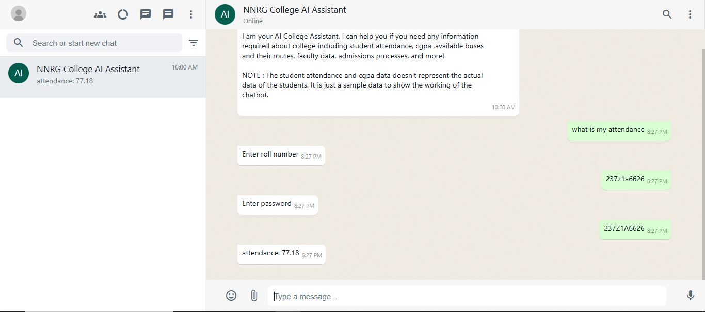
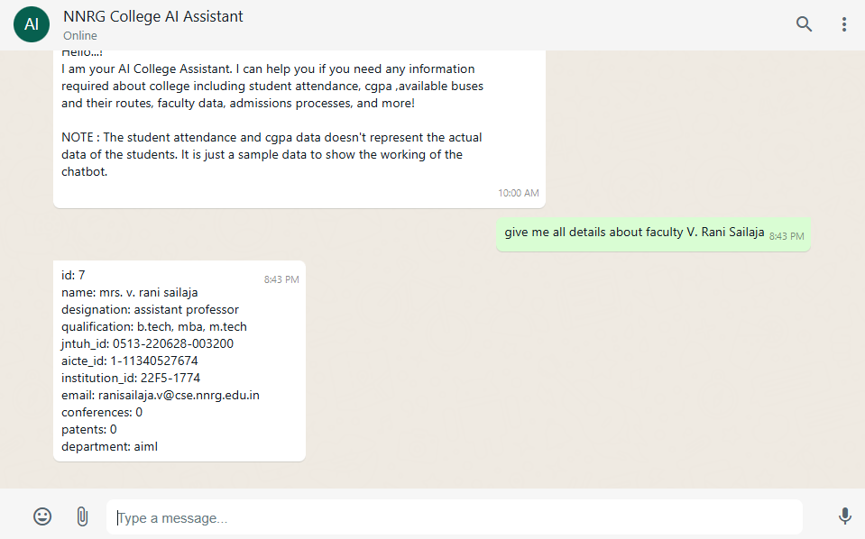
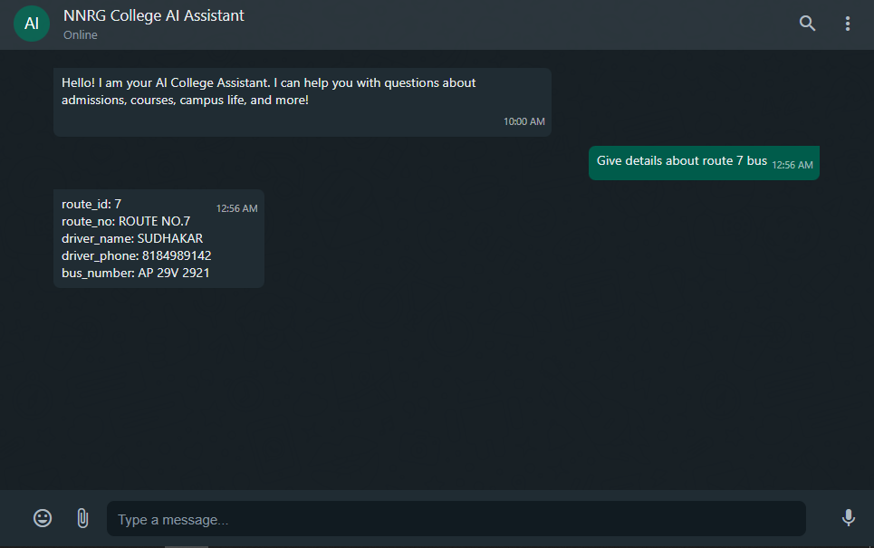
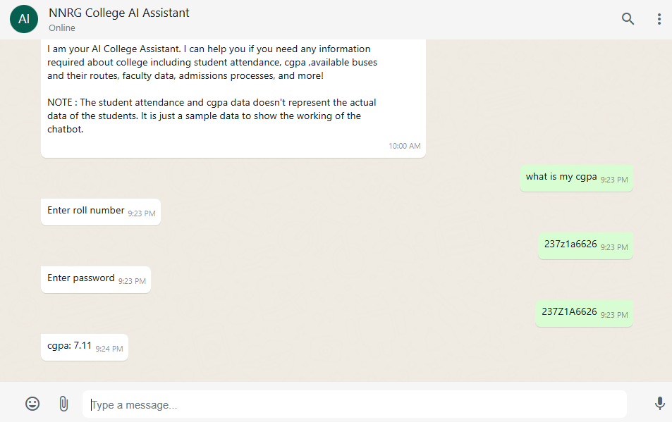
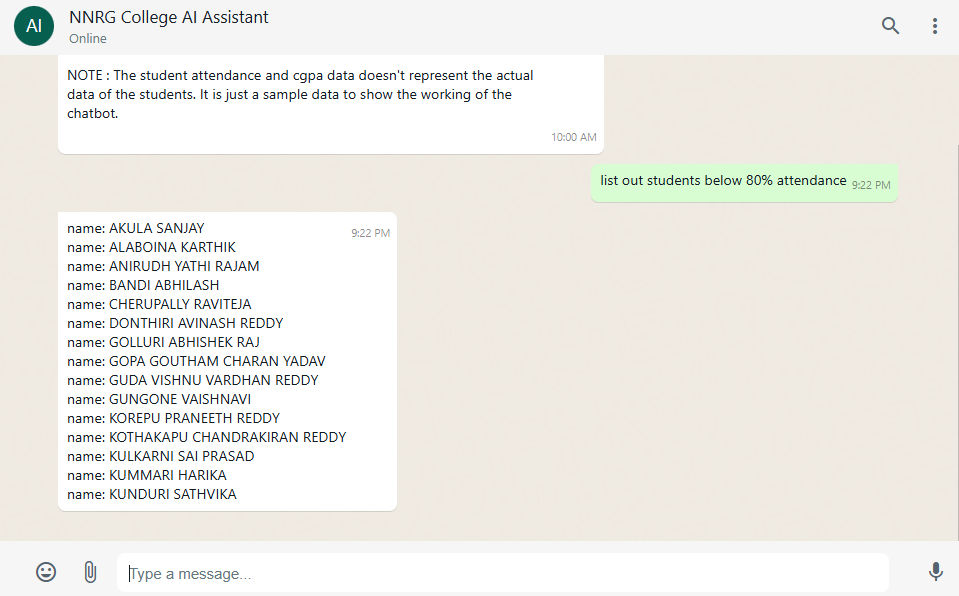

# Chatbot System for College Information Management

An AI-powered chatbot system designed to automate college-related query handling using Natural Language Processing (NLP), Large Language Models (LLMs), and PostgreSQL database integration. The chatbot provides real-time responses for student, faculty, admissions, transport, and placement-related queries. 

---

## Features

* Natural language query handling
* Dynamic SQL query generation using LLMs
* Semantic table routing
* Entity extraction from user queries
* Authentication for sensitive student data
* Secure SQL validation
* Real-time database response generation
* User-friendly chatbot interface

---

## Technologies Used

### Backend

* Python
* Flask
* Flask-CORS
* PostgreSQL
* psycopg2
* bcrypt

### AI & NLP

* Ollama
* Sentence Transformers
* BM25
* LLM Models:

  * `prem1b-sql`
  * `phi3:mini`

### Frontend

* HTML
* CSS
* JavaScript

---

## System Architecture

The system consists of the following modules:

1. User Interface Module
2. Authentication & Access Control Module
3. Query Understanding & SQL Generation Module
4. Query Safety & Database Execution Module
5. Response Generation Module

The chatbot processes user queries through a pipeline involving:

* Query rewriting
* Entity extraction
* Table selection
* SQL generation
* SQL validation
* Database execution
* Response formatting


---

## Functionalities

* Student attendance queries
* CGPA retrieval
* Faculty information lookup
* Bus route details
* Admission-related information
* Placement-related queries

---

## Project Workflow

```text
User Query
   ↓
Query Processing
   ↓
Entity Extraction
   ↓
Semantic Table Routing
   ↓
LLM-based SQL Generation
   ↓
SQL Validation
   ↓
Database Execution
   ↓
Response Generation
```

---

## Installation

### Clone the Repository

```bash
git clone https://github.com/your-username/your-repo-name.git
cd your-repo-name
```

### Install Dependencies

```bash
pip install -r requirements.txt
```

### Setup PostgreSQL Database

Create a PostgreSQL database and configure credentials in your project.

### Run Ollama Models

```bash
ollama run phi3:mini
```

### Start Flask Server

```bash
python app.py
```

---

## Sample Query Examples

```text
What is my attendance?
Show faculty details
Route 7 bus details
What is my CGPA?
```

---

## Security Features

* Authentication for sensitive queries
* Password hashing using bcrypt
* SQL injection prevention
* SELECT-only query validation

---

## Testing

The system was tested using:

* Unit Testing
* Integration Testing
* System Testing
* Security Testing
* UI Testing

All major test cases passed successfully. 

---

## Future Enhancements

* Voice-based interaction
* Mobile application support
* Multi-language support
* JWT authentication
* Multi-table JOIN query support
* Real-time data synchronization
* Advanced analytics dashboard

---

## Output Screenshots











---

## References

* Flask Documentation
* PostgreSQL Documentation
* Sentence Transformers
* Ollama API
* BM25 Algorithm
